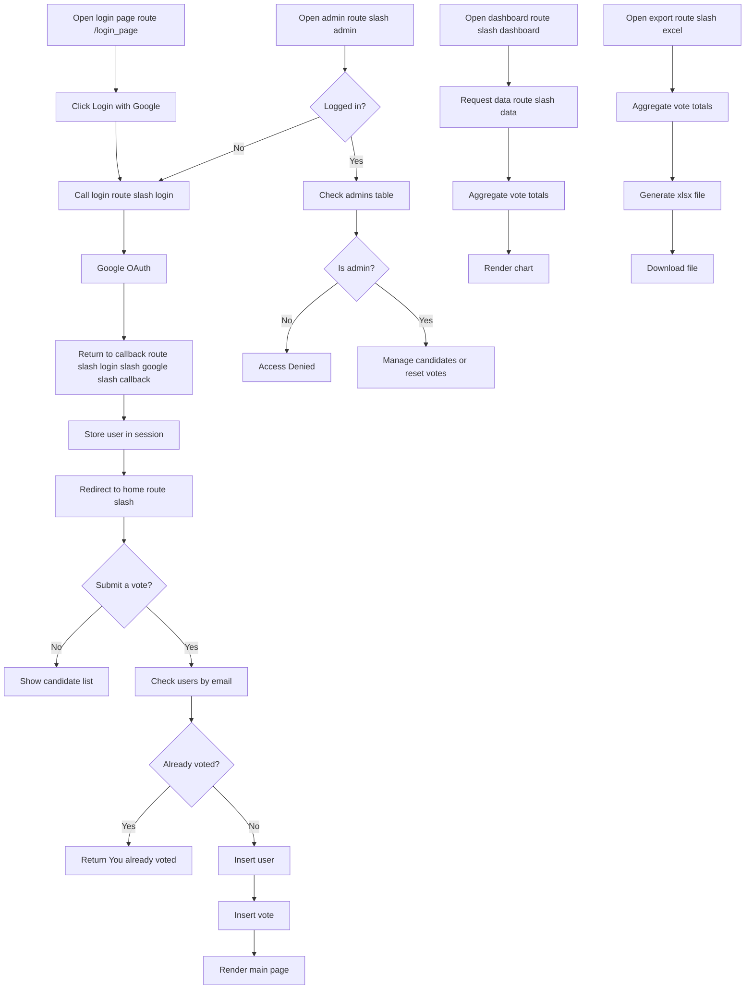

# Voting Web Application

Online voting system built with Flask, PostgreSQL, and Google OAuth. Users sign in with Google, vote once per account, admins manage candidates, and the system provides a live dashboard plus Excel export.

## Overview

Main application flow:

1. User opens `/login_page`
2. User clicks `Login with Google`
3. The app redirects to Google OAuth
4. After a successful login, the app stores the user in the session
5. The user selects a candidate and submits a vote
6. The app checks whether that email has already voted
7. If not, it stores records in `users` and `votes`
8. Admins use `/admin` to add candidates, delete candidates, or reset votes
9. `/dashboard` loads vote totals from `/data`
10. `/excel` generates an `.xlsx` summary file

This repository currently preserves the original voting flow and UI from the reference server, not the later lucky-wheel version.

## Features

- Google sign-in
- One vote per Google account
- Admin panel for candidate management
- Candidate deletion
- Vote reset from the admin page
- Live dashboard with Chart.js
- Excel export of vote totals
- Docker-based deployment
- Reverse-proxy support via `ProxyFix`

## Tech Stack

- Backend: Flask
- Database: PostgreSQL
- Authentication: Authlib + Google OAuth 2.0
- Frontend: HTML + Bootstrap
- Charting: Chart.js
- Excel export: OpenPyXL
- Production server: Gunicorn
- Containerization: Docker + Docker Compose

## Routes

| Route | Method | Description |
| --- | --- | --- |
| `/` | `GET`, `POST` | Main voting page and vote submission |
| `/login_page` | `GET` | Login page |
| `/login` | `GET` | Start Google OAuth |
| `/login/google/callback` | `GET` | Google OAuth callback |
| `/logout` | `GET` | Clear session |
| `/admin` | `GET`, `POST` | Admin page and candidate creation |
| `/delete/<id>` | `GET` | Delete candidate |
| `/reset` | `POST` | Reset users and votes |
| `/dashboard` | `GET` | Dashboard page |
| `/data` | `GET` | Vote totals as JSON |
| `/excel` | `GET` | Download results as Excel |

## Application Flow



Standalone diagram: [docs/SYSTEM_FLOWCHART.md](/home/thiraphat/voting-webapp/docs/SYSTEM_FLOWCHART.md)

## Project Structure

```text
voting-webapp/
├── voting_app.py
├── export.py
├── schema.sql
├── requirements.txt
├── Dockerfile
├── docker-compose.yml
├── templates/
│   ├── home.html
│   ├── login.html
│   ├── admin.html
│   └── dash.html
├── docs/
│   └── SYSTEM_FLOWCHART.md
└── README.md
```

## Database Schema

Schema file: [schema.sql](/home/thiraphat/voting-webapp/schema.sql)

Core tables:

- `users`: stores voter email addresses
- `candidates`: stores candidate names
- `votes`: stores the user-to-candidate vote relationship
- `admins`: stores admin email addresses

Rules:

- `users.name` is unique
- `votes.user_id` is unique
- one Google account can vote only once

## Environment Variables

Create `.env` from [`.env.example`](/home/thiraphat/voting-webapp/.env.example).

```env
APP_PORT=8081

DB_HOST=host.docker.internal
DB_PORT=5432
DB_NAME=voting
DB_USER=postgres
DB_PASS=change-me

SECRET_KEY=change-this-secret-key

GOOGLE_CLIENT_ID=your-google-client-id
GOOGLE_CLIENT_SECRET=your-google-client-secret
```

Variable descriptions:

- `APP_PORT`: host port exposed by Docker Compose
- `DB_HOST`: PostgreSQL host
- `DB_PORT`: PostgreSQL port
- `DB_NAME`: database name
- `DB_USER`: database username
- `DB_PASS`: database password
- `SECRET_KEY`: Flask session secret
- `GOOGLE_CLIENT_ID`: Google OAuth client ID
- `GOOGLE_CLIENT_SECRET`: Google OAuth client secret

## Google OAuth Setup

Configure Google Cloud Console as follows:

1. Open `APIs & Services`
2. Go to `Credentials`
3. Create or edit an `OAuth 2.0 Client ID`
4. Choose `Web application`
5. Add the correct callback URL

Example callback:

```text
https://your-domain/login/google/callback
```

Important:

The current `/login` route generates the callback using:

```python
url_for("google_callback", _external=True, _scheme="https")
```

That means the callback is always generated as `https`. If you deploy behind a reverse proxy or public domain, the Google OAuth configuration must match the final public URL exactly.

## Local Development

### 1. Create a virtual environment

```bash
python3 -m venv .venv
source .venv/bin/activate
```

### 2. Install dependencies

```bash
pip install -r requirements.txt
```

### 3. Create the database

Example:

```bash
createdb voting
psql -d voting -f schema.sql
```

### 4. Add at least one admin

Example:

```sql
INSERT INTO admins (email) VALUES ('your-admin@gmail.com');
```

### 5. Create `.env`

```bash
cp .env.example .env
```

Then fill in the real database and Google OAuth values.

### 6. Run the app

```bash
python3 voting_app.py
```

Default local URL:

```text
http://127.0.0.1:8080
```

## Docker Deployment

Start the app:

```bash
docker compose up -d --build
```

View logs:

```bash
docker compose logs -f
```

Stop the app:

```bash
docker compose down
```

Notes:

- the container exposes internal port `8080`
- the external host port is controlled by `APP_PORT`
- `docker-compose.yml` loads values from `.env`
- Gunicorn serves `voting_app:app`

## Deployment for `10.33.1.34`

For the current deployment on that machine:

- app path: `~/voting-webapp`
- runtime: `docker compose`
- exposed port: `8083`

Example `.env` for that server:

```env
APP_PORT=8083
DB_HOST=10.33.1.34
DB_PORT=5432
DB_NAME=voting
DB_USER=voting_app
DB_PASS=your-db-password

SECRET_KEY=your-secret-key

GOOGLE_CLIENT_ID=your-google-client-id
GOOGLE_CLIENT_SECRET=your-google-client-secret
```

Deployment steps:

```bash
cd ~/voting-webapp
docker compose up -d --build
```

Basic checks:

```bash
docker ps
curl -I http://127.0.0.1:8083/login_page
```

LAN URL:

```text
http://10.33.1.34:8083
```

If Google login is required on that server, verify that the callback URL in Google Cloud matches the real public URL exactly.

## Admin Usage

A user can access `/admin` only if the email already exists in the `admins` table.

Example:

```sql
INSERT INTO admins (email) VALUES ('your-admin@gmail.com');
```

The admin page can:

- add candidates
- delete candidates
- reset `users` and `votes`

## `/data` Response Format

Example response:

```json
{
  "labels": ["Alice", "Bob"],
  "votes": [3, 5]
}
```

## Excel Export

The `/excel` route generates an `.xlsx` file containing:

- candidate name
- vote total

## Reverse Proxy and HTTPS

The application uses:

```python
app.wsgi_app = ProxyFix(app.wsgi_app, x_proto=1, x_host=1)
```

If you deploy behind Nginx, Traefik, Cloudflare, or another reverse proxy:

- forward `X-Forwarded-Proto`
- forward `Host`
- make sure the public URL matches the Google OAuth callback URL

## Current Limitations

- uses a global database connection and cursor
- `/delete/<id>` still uses `GET`
- OAuth callback generation is fixed to `https`
- there is no `/health` route
- the code intentionally stays close to the original reference implementation and is not yet refactored for heavier production workloads

## Common Issues

### `redirect_uri_mismatch`

Cause:

- the callback URL in Google Cloud Console does not match the URL generated by the application

Fix:

- add the exact callback URL used by the deployed app

### `Access Denied` on `/admin`

Cause:

- the logged-in Google email is not in the `admins` table

Fix:

- insert the email into `admins`

### `You already voted`

Cause:

- that Google account already has a vote

Fix:

- this is expected behavior
- for testing, reset votes from `/admin`

### PostgreSQL connection failure

Check:

- `DB_HOST`
- `DB_PORT`
- `DB_NAME`
- `DB_USER`
- `DB_PASS`
- firewall rules
- PostgreSQL listen address

## Security Notes

- never commit `.env`
- rotate secrets immediately if they were exposed
- use a strong `SECRET_KEY`
- allow only trusted Google accounts in `admins`
- use HTTPS for real deployments

## License

This repository does not currently include a license file. Add one if the project will be shared publicly.
