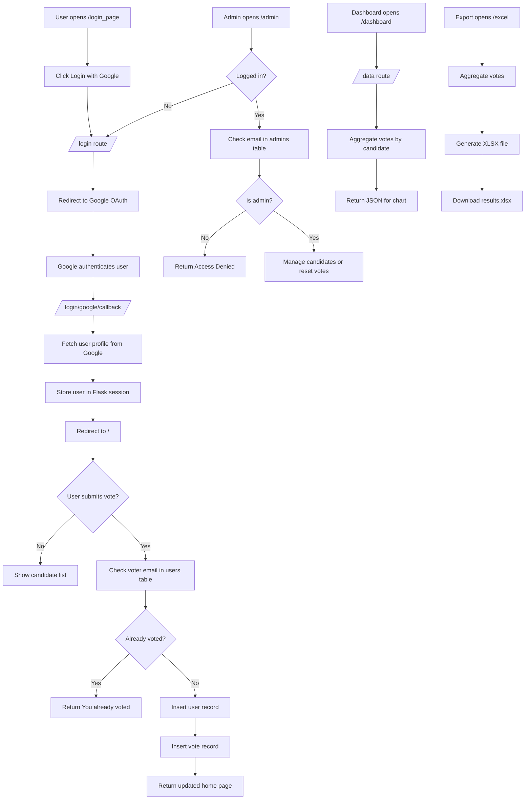

# Voting Web Application

Web voting system built with Flask and PostgreSQL. The application supports Google OAuth login, candidate management for admins, a live results dashboard, and Excel export.

## Overview

This project is a simple online voting platform with three main user flows:

- Voters sign in with Google and submit one vote.
- Admins manage candidate records from the admin page.
- Anyone with access to the dashboard can view live vote totals.

The application is designed to run behind a reverse proxy such as Nginx or Cloudflare and uses PostgreSQL as its persistent data store.

## Features

- Google OAuth login with Authlib
- One vote per Google account
- Admin panel for candidate management
- Live dashboard backed by JSON data
- Excel export of voting results
- PostgreSQL database
- Reverse-proxy support via `ProxyFix`
- Docker-based deployment

## Tech Stack

- Backend: Flask
- Authentication: Google OAuth 2.0 via Authlib
- Database: PostgreSQL
- Frontend templates: HTML + Bootstrap
- Charts: Chart.js
- Export: OpenPyXL
- Runtime: Gunicorn
- Containerization: Docker and Docker Compose

## System Architecture

- Client browser accesses the Flask application through a reverse proxy or public HTTPS domain.
- Flask handles page rendering, session management, OAuth redirects, and database writes/reads.
- Google OAuth validates the user identity and returns profile information.
- PostgreSQL stores admins, candidates, voters, and votes.
- The dashboard and Excel export read aggregate vote totals from PostgreSQL.

## System Flowchart

The main application flow is shown below. GitHub renders Mermaid diagrams directly in Markdown.



For a standalone version, see [docs/SYSTEM_FLOWCHART.md](/home/thiraphat/voting-webapp/docs/SYSTEM_FLOWCHART.md).

## Route Summary

| Route | Method | Description |
| --- | --- | --- |
| `/` | `GET`, `POST` | Main voting page and vote submission |
| `/login_page` | `GET` | Login screen |
| `/login` | `GET` | Starts Google OAuth flow |
| `/login/google/callback` | `GET` | Google OAuth callback |
| `/logout` | `GET` | Clears session |
| `/admin` | `GET`, `POST` | Admin page and candidate creation |
| `/delete/<id>` | `GET` | Deletes a candidate |
| `/reset` | `POST` | Resets vote and user tables |
| `/dashboard` | `GET` | Dashboard page |
| `/data` | `GET` | JSON endpoint for vote totals |
| `/excel` | `GET` | Downloads vote totals as Excel |

## Database Schema

The core schema is defined in [schema.sql](/home/thiraphat/voting-webapp/schema.sql).

### Tables

- `users`: stores each voter email once
- `candidates`: stores candidate names
- `votes`: links one user to one candidate
- `admins`: stores admin email addresses

### Vote Integrity

- The `users.name` column is unique.
- The `votes.user_id` column is unique.
- The application checks whether the voter email already exists before inserting a new vote.

## Environment Variables

Create a `.env` file based on [.env.example](/home/thiraphat/voting-webapp/.env.example).

```env
APP_PORT=8080

DB_HOST=your_database_host
DB_PORT=5432
DB_NAME=your_database_name
DB_USER=your_database_user
DB_PASS=your_database_password

SECRET_KEY=your_secret_key

GOOGLE_CLIENT_ID=your_google_client_id
GOOGLE_CLIENT_SECRET=your_google_client_secret

SESSION_COOKIE_SECURE=true
```

### Variable Notes

- `APP_PORT`: host port mapped to the container
- `DB_HOST`: PostgreSQL host reachable from the app container
- `DB_PORT`: PostgreSQL port, usually `5432`
- `DB_NAME`: database name
- `DB_USER`: database username
- `DB_PASS`: database password
- `SECRET_KEY`: Flask session secret
- `GOOGLE_CLIENT_ID`: OAuth client ID from Google Cloud Console
- `GOOGLE_CLIENT_SECRET`: OAuth client secret from Google Cloud Console
- `SESSION_COOKIE_SECURE`: should stay `true` in production over HTTPS

## Google OAuth Setup

Create or reuse a Google OAuth client in Google Cloud Console:

1. Open `Google Cloud Console`
2. Select the correct project
3. Go to `APIs & Services` > `Credentials`
4. Create or open an `OAuth 2.0 Client ID`
5. Choose `Web application`
6. Add the production callback URL to `Authorized redirect URIs`

Example redirect URI:

```text
https://your-domain/login/google/callback
```

For this deployment, the redirect URI should be:

```text
https://voting.thiraphat.work/login/google/callback
```

## Local Development

### 1. Install dependencies

```bash
pip install -r requirements.txt
```

### 2. Set up PostgreSQL

Create the database, then run:

```bash
psql -U postgres -d voting -f schema.sql
```

Adjust the command if your database name or user differs.

### 3. Create `.env`

Copy the example and fill in real values:

```bash
cp .env.example .env
```

### 4. Run the app

```bash
python3 voting_app.py
```

The application listens on port `8080` by default unless `PORT` or container config overrides it.

## Docker Deployment

Build and start the service:

```bash
docker compose up -d --build
```

### Deployment Notes

- The container listens on internal port `8080`.
- The host port is controlled by `APP_PORT`.
- `docker-compose.yml` loads environment variables from `.env`.
- Gunicorn runs the Flask app in production.

If PostgreSQL runs on the same host machine instead of another container:

- Set `DB_HOST` to a reachable host IP or DNS name.
- On Linux, `host.docker.internal` may need extra host-gateway mapping.

## Reverse Proxy Notes

This app expects to run behind HTTPS in production.

- `ProxyFix` is enabled for forwarded host and protocol handling.
- `SESSION_COOKIE_SECURE=true` means cookies are only sent over HTTPS.
- Google OAuth callback URLs must use the public HTTPS domain.

If the reverse proxy does not forward `X-Forwarded-Proto` correctly, OAuth redirects and secure session behavior may fail.

## Common Issues

### Google login shows `Missing required parameter: client_id`

Cause:

- `GOOGLE_CLIENT_ID` is missing or empty in the server environment.

Fix:

1. Open Google Cloud Console
2. Copy the OAuth `Client ID`
3. Put it in `.env` as `GOOGLE_CLIENT_ID`
4. Restart the application or container

### Google login shows `redirect_uri_mismatch`

Cause:

- The callback URL in Google Cloud Console does not exactly match the URL generated by the app.

Fix:

- Add the exact production callback URL:
  `https://voting.thiraphat.work/login/google/callback`

### Session is lost after returning from Google login

Possible causes:

- `SECRET_KEY` is missing or changes between restarts
- Secure cookies are enabled but the site is not served over HTTPS
- Reverse proxy headers are not forwarded correctly

### Database connection fails

Check:

- `DB_HOST`
- `DB_PORT`
- `DB_NAME`
- `DB_USER`
- `DB_PASS`
- PostgreSQL network accessibility from the app container

## Project Structure

```text
.
├── voting_app.py
├── schema.sql
├── requirements.txt
├── Dockerfile
├── docker-compose.yml
├── templates/
│   ├── admin.html
│   ├── dash.html
│   ├── home.html
│   └── login.html
└── docs/
    └── SYSTEM_FLOWCHART.md
```

## Security Notes

- Do not commit `.env` with real secrets.
- Use a strong `SECRET_KEY`.
- Keep `SESSION_COOKIE_SECURE=true` for production.
- Restrict admin access by controlling entries in the `admins` table.
- Consider converting destructive admin routes such as `/delete/<id>` to `POST` in a later hardening pass.

## Future Improvements

- Add CSRF protection for admin and voting forms
- Add explicit validation and friendlier error pages
- Add health checks and structured logging
- Add unit and integration tests
- Add containerized PostgreSQL for fully self-contained local development
- Improve admin authorization and audit logging
