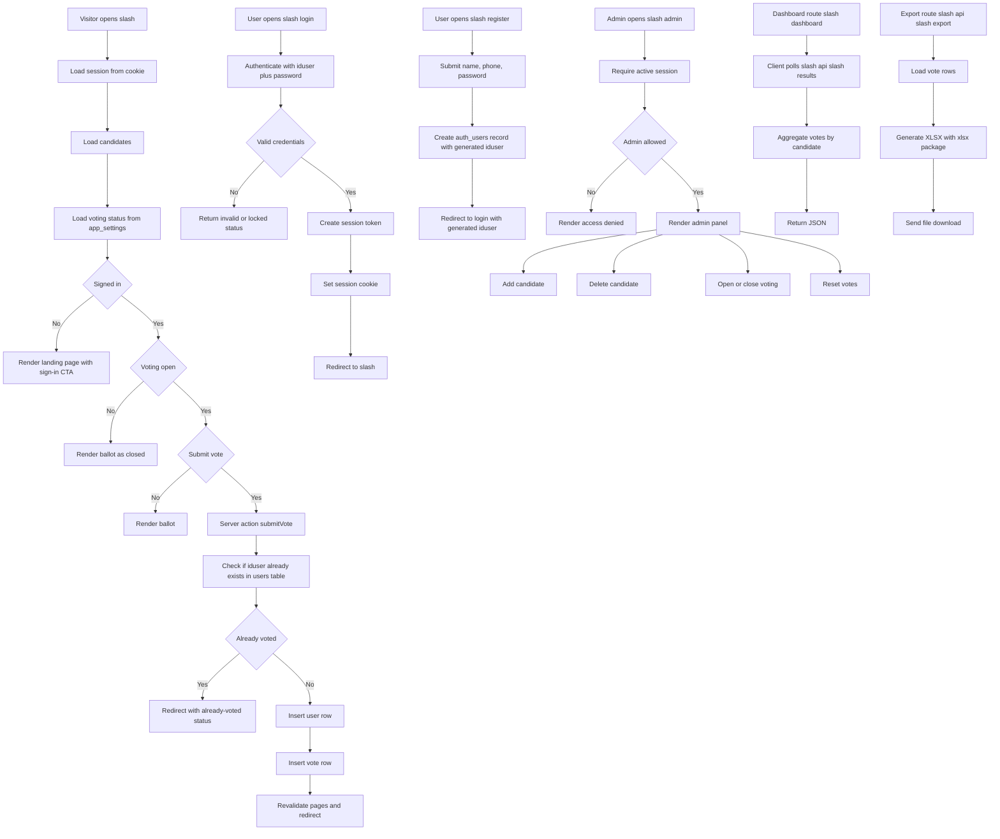

# Pulse Vote

Open-source voting web application built with Next.js and PostgreSQL.

**Live app:** https://voting.thiraphat.work  
**Flowchart source:** [docs/SYSTEM_FLOWCHART.md](/home/thiraphat/voting-webapp/docs/SYSTEM_FLOWCHART.md)  
**License:** [MIT](./LICENSE)

## What This Project Is

Pulse Vote is a simple, deployable voting system for small events, classrooms, demos, or internal selections.
It provides local account-based sign-in, one-vote-per-user enforcement, a live results dashboard, Excel export, and an admin panel for managing the ballot and controlling when voting is open.

This repository is intended to be public, understandable, and easy to extend.

## Highlights

- Local authentication with `iduser + password`
- Simple account registration with only the required fields
- One vote per account
- Admin-only candidate management
- Admin-controlled voting open/close toggle
- Vote reset for a fresh round
- Live result polling on the dashboard
- Excel export for audit or reporting
- Dark mode as the default UI
- Docker-based deployment

## Tech Stack

- Next.js 14 App Router
- React 18
- PostgreSQL
- `pg` for database access
- `xlsx` for export generation
- Docker Compose for deployment

## Core User Flows

### Voter

1. Create an account
2. Sign in with `iduser + password`
3. Vote once
4. View live results on the dashboard

### Admin

1. Sign in with an admin account
2. Add or remove candidates
3. Open or close voting
4. Reset votes
5. Export voting data

## System Flowchart



## Routes

| Route | Purpose |
| --- | --- |
| `/` | Voting page |
| `/login` | Sign in |
| `/register` | Create account |
| `/admin` | Admin panel |
| `/dashboard` | Live results board |
| `/api/results` | Dashboard JSON endpoint |
| `/api/export` | Excel export endpoint |

## Project Structure

```text
app/                 App Router pages, server actions, API routes
components/          Reusable UI components
lib/                 Database, auth, and data helpers
docs/                Project documentation and flowcharts
public/              Static public assets
Dockerfile           Production image build
docker-compose.yml   Container orchestration
```

## Data Model Notes

The app uses PostgreSQL and separates authentication data from voting data.

Main tables in use:

- `auth_users`
- `auth_session_tokens`
- `auth_login_attempts`
- `app_settings`
- `users`
- `votes`
- `candidates`
- `admins`

Notes:

- Voting state is stored in `app_settings`
- Voting records remain separate from auth session data
- Admin access is controlled through `ADMIN_IDUSERS`
- Only registered accounts whose `iduser` appears in `ADMIN_IDUSERS` can open `/admin`

## Environment Variables

Copy `.env.example` to `.env` and update it for your environment.

```env
APP_PORT=8081

DB_HOST=127.0.0.1
DB_PORT=5432
DB_NAME=voting
DB_USER=postgres
DB_PASS=your-password
DB_SSL=false

ADMIN_IDUSERS=
```

Example:

```env
ADMIN_IDUSERS=GL0001,GL0002
```

### Important

- Do not commit real database credentials to a public repository
- Use a dedicated database user in production
- Replace placeholder values in `.env.example` before deployment

## Local Development

### Prerequisites

- Node.js 20+
- npm
- PostgreSQL

### Install

```bash
npm install
```

### Run in development

```bash
npm run dev
```

Open: `http://127.0.0.1:8081`

### Local scripts

```bash
npm run dev
npm run dev:local
npm run start
npm run start:local
```

These default to port `8081` to avoid collisions with services that may already use `8080`.

## Production / Server

### Build and run directly

```bash
npm run build
npm run start:server
```

### Server-oriented scripts

```bash
npm run dev:server
npm run start:server
```

These use port `8080` inside the app process.

## Docker Deployment

Run:

```bash
docker compose up -d --build
```

The container exposes port `8080`, and `docker-compose.yml` maps it externally with:

```env
APP_PORT
```

Example:

- internal container port: `8080`
- external host port: `8083`
- resulting public URL example: `http://host:8083`

## Validation

Typical verification steps used during development:

```bash
npm run build
```

If you add ESLint configuration later, you can also run:

```bash
npm run lint
```

## Security Notes

- Do not hardcode admin credentials in source code
- Grant admin access only through `ADMIN_IDUSERS`
- For a real deployment, rotate admin credentials and restrict database access
- Keep `.env` private
- Serve the public app behind HTTPS

## Roadmap Ideas

- Role management from the admin UI
- Audit log for admin actions
- Better rate limiting and abuse controls
- Optional email or SMS verification
- Better theming and branding customization

## Contributing

Issues, improvements, and pull requests are welcome.

If you want to extend the project, a good place to start is:

- authentication hardening
- admin UX
- export formats
- deployment automation
- database migrations

## License

This project is released under the MIT License.
See [LICENSE](./LICENSE).
