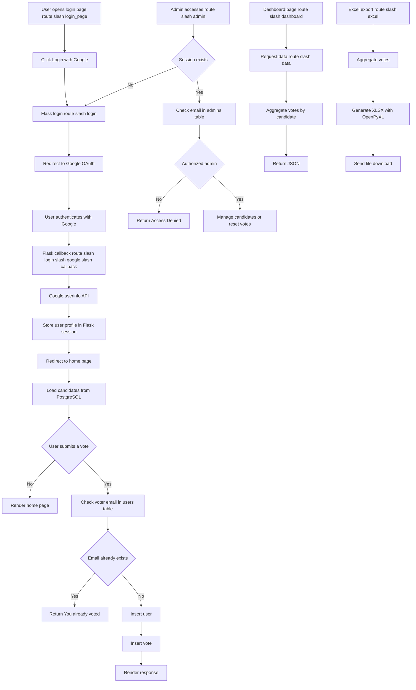

# System Flowchart

This document summarizes the current runtime flow of the voting application.

## Main Components

- Browser client
- Flask application
- Google OAuth provider
- PostgreSQL database
- Optional reverse proxy such as Nginx or Cloudflare

## Notes

- The app trusts forwarded host and protocol headers through `ProxyFix`.
- Google OAuth depends on valid `GOOGLE_CLIENT_ID` and `GOOGLE_CLIENT_SECRET`.
- The production callback URL must match the value configured in Google Cloud Console.
