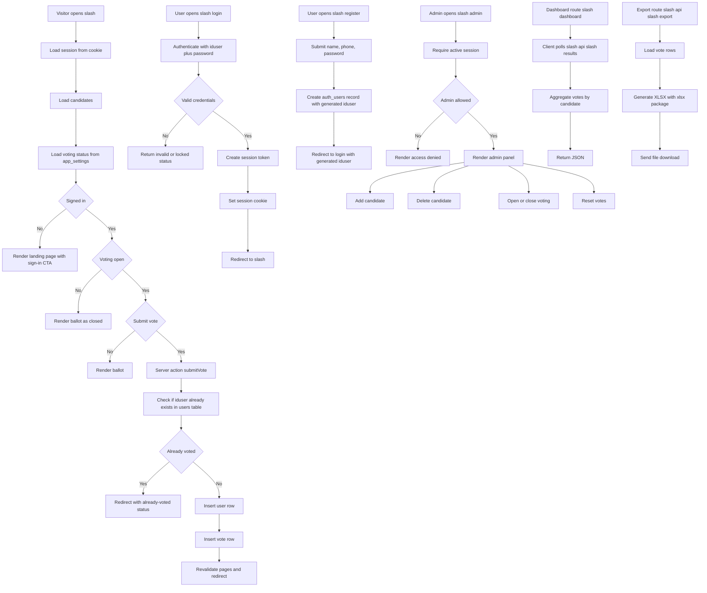

# System Flowchart

This document summarizes the current runtime flow of the voting application.

## Main Components

- Next.js App Router pages, route handlers, and server actions
- PostgreSQL database
- Local session-cookie authentication
- Docker-based deployment

## Notes

- Authentication data is stored separately from vote data.
- Voting availability is controlled through the `app_settings` table.
- Admin access is controlled through the `ADMIN_IDUSERS` environment variable.
